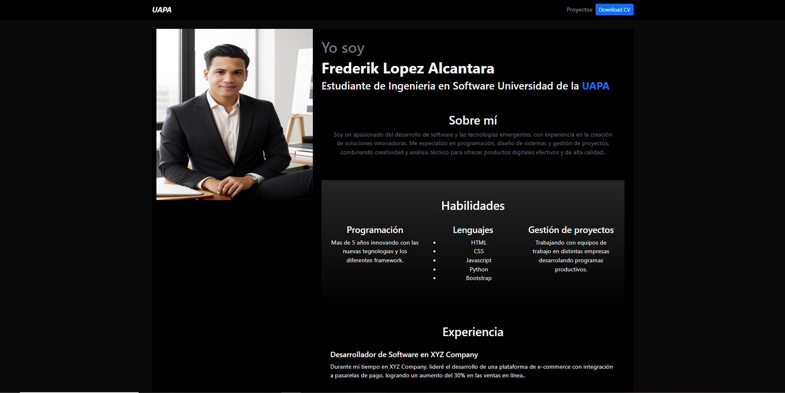

## Django Portofolio Example

this is a basic portfolio in dark mode


### Installation

```
descomprimir el archivo zip
Ejectutar los siguientes comandos
python -m venv env  
env/Scripts/activate  
pip install -r requirements.txt 
python manage.py migrate  
python manage.py runserver     

```

Entras a  <a href="http://localhost:8000" target="_blank">http://localhost:8000</a>